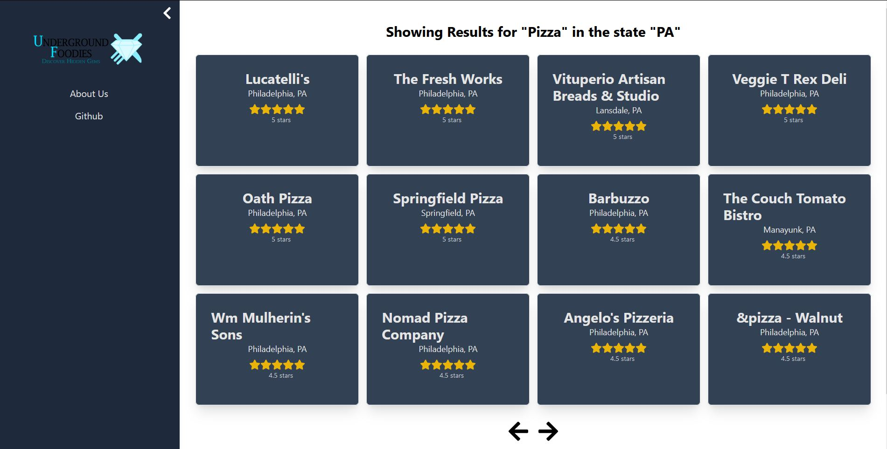
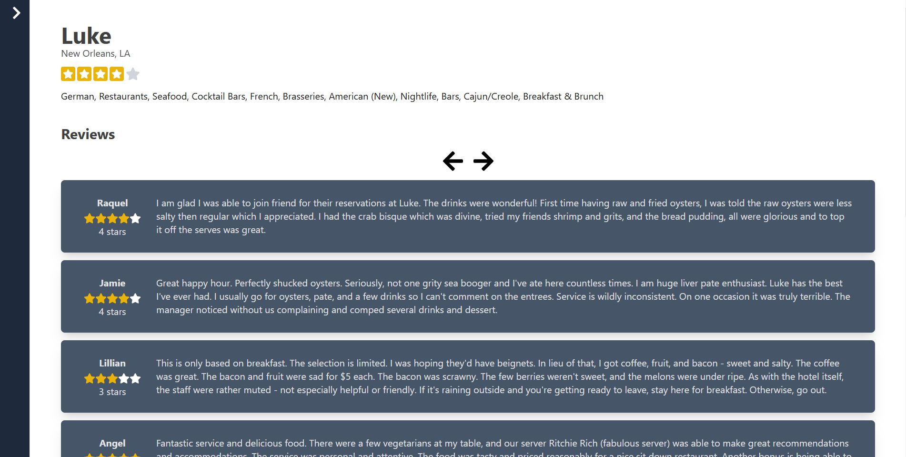
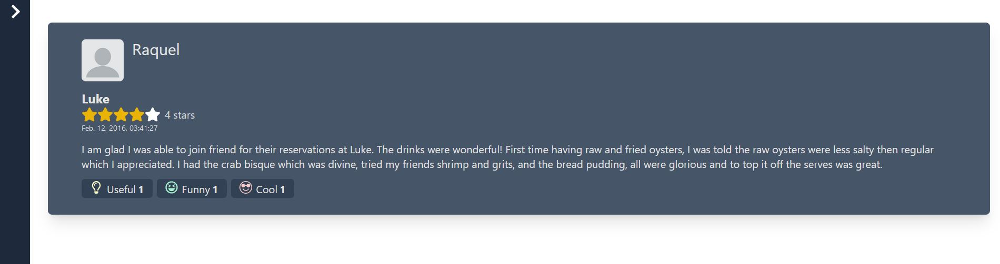
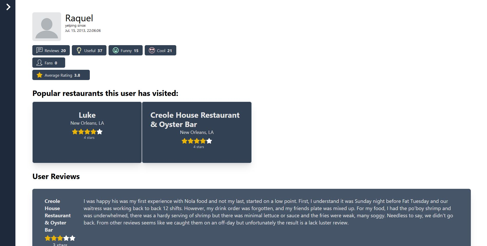

## Table of Contents

1. [Description](#description)
2. [Getting Started](#getting-started)
3. [Documentation](#documentation)
4. [Screenshots](#screenshots)
5. [Deployed Link](#deployed-link)
6. [Credits](#credits)

## Description
Underground Foodies is a web application used to browse for restaurants and other businesses using the Yelp Database. It features searching using names and categories in a certain state, and displaying information about businesses, reviews, and users available in the database. This application was built as a final project for CIS 5500, Database and Information Systems.

## Getting Started

1. Create a `.env` file and fill in all variables following `.env.template` (env file should already be available for graders)
2. To install dependencies for both the server and the client, run `npm run install:all` at the root of the project.
3. To run the server in dev mode with hot reload, run `cd` into `server` then
   run `npm run start:dev`.
4. To run the client in dev mode with hot reload, run `cd` into `client` then run `npm run start`.
5. Alternatively, run `npm run develop` to do both of the above, as long as you've installed concurrently (which should've been done from step 2)

## Documentation
### Home Page
Upon entering the app, you are greeted with the home page. It contains a search box where you may type in a name or category and a state to search for businesses. Below the search box is a list of the cities with the most businesses. These cards are not interactable. Once you've typed in a search, you may press "Search" or hit "ENTER" to continue.

### Results Page
Once the search results show up, you are shown up to 12 of the search results at once. On the left hand side there is a navbar tha can be expanded and collapsed at will. This contains an about us page and the link to the github. The cards on the page indicate different businesses that meet the search criteria, and can be clicked to go the respective business page. You may navigate to different pages of businesses using the left/right arrow keys.

### Business Page
A business page contains information about a singular business, including average stars, city and state location, categories, reviews, and related businesses. The reviews can be clicked to go to the respective review page. The related businesses can be clicked to redirect to another business's page. You may navigate to different pages of reviews using the left/right arrow keys.

### Review Page
A review page contains a information about a singular review, including reviewer name, the businesses associated with the review, the stars, date and time of the review, the content of the review, and the subjective ratings, useful, funny, and cool. Clicking the name of the reviewer takes you to the respective user's page.

### User Page
A user page contains information about a single user, including name, number of reviews, number of subjective useful, funny, and cool ratings, number of fans, average rating by this user, popular restaurants that this user has visited, all the user reviews, and the recommended businesses from the city this user has reviewed most frequently. Clicking on any of the reviews takes you to the respective review page, and clicking on any of the businesses takes you to the respective business page. You may navigate to different pages of reviews using the left/right arrow keys.

### About Us/Credits Page
This page contains credits to the assets (database) we used and the collaborators of this project.

## Screenshots
### Home Page

### Results Page With Navbar

### Business Page

### Review Page

### User Page

## Deployed Link
COMING SOON

## Credits

Ken Yamada: https://github.com/yamakenth

Antina Yeh: https://github.com/antinayeh

Peici Qiu: https://github.com/peiciqiu

Voravich Silapachairueng: https://github.com/voravichs
